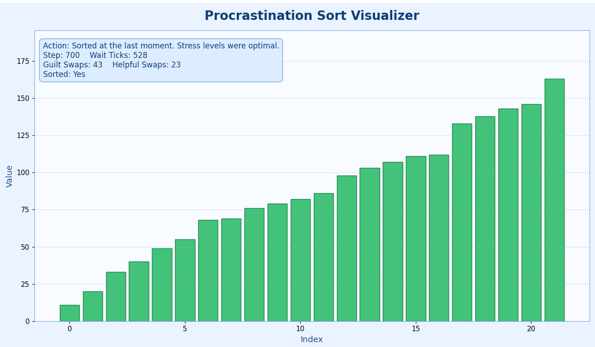

# Procrastination Sort (Python + Visualizer)

Procrastination Sort is a joke algorithm that behaves like this:

1. Check whether the list is already sorted.
2. If not sorted, do nothing for a random amount of time.
3. Occasionally perform a random swap out of guilt.
4. Rarely make accidental useful progress.
5. Near deadline, panic and finally sort by repeated adjacent inversion fixes.

It is intentionally inefficient, but the visualization makes the behavior easy to understand.

## The Full Algorithm (Real Flow)

The implementation is event-driven. Instead of just returning a sorted list, it yields animation snapshots with metadata (action text, step count, waits, swaps, and sorted status).

### Phase A: Initial State

- Copy the input list.
- Emit one snapshot: "Staring at the list... building motivation."

### Phase B: Main Procrastination Loop

Repeat while `step < max_steps`:

1. If list is sorted, stop successfully.
2. Pick random wait ticks in `[min_wait_ticks, max_wait_ticks]`.
3. For each wait tick:
	- Increase `step` and `total_wait`.
	- Emit a snapshot: "Procrastinating..."
4. Try to do something:
	- With probability `guilt_probability` (default `0.65`), swap two random indices.
	- Measure whether this reduced inversion count (a "helpful" guilt swap).
	- Emit a snapshot highlighting the swapped bars.
5. If no guilt swap happened, maybe do accidental productivity:
	- With probability `productive_nudge_probability` (default `0.20`), find the first adjacent inversion and swap it.
	- Emit snapshot with highlights.
6. If neither action happened, emit "Opened another tab instead of sorting."

### Phase C: Deadline Panic Mode

When `max_steps` is reached without sorting:

1. Repeatedly find first adjacent inversion.
2. Swap that pair.
3. Continue up to `panic_steps` (default `400`) or until sorted.

This behaves like a focused adjacent-inversion repair pass and is what usually guarantees convergence.

### Phase D: Final Snapshot

Emit one final state with:

- "Sorted at the last moment..." if sorted.
- "Still not sorted. Maybe tomorrow." if panic limit was insufficient.

## Why It Eventually Sorts

- Random guilt swaps alone do not guarantee monotonic progress.
- The panic phase repeatedly fixes inversions left-to-right.
- Every such fix reduces disorder locally, and repeated passes eventually eliminate all inversions (within the panic limit).

So the algorithm is mostly chaos, then deterministic urgency.

## Complexity Notes

This is not a practical sorter.

- During guilt swaps, inversion counting is used before/after each random swap.
- Inversion counting is `O(n^2)`.
- Waiting/action cycles can be many.
- Panic mode can run up to `panic_steps`, each step doing a linear scan for first inversion (`O(n)`).

Overall runtime is dominated by random-loop behavior and can be very large relative to standard sorting algorithms.

## Visualization Meaning

Color semantics:

- Blue bars: normal unsorted state.
- Orange bars: most recent swapped indices.
- Green bars: list currently sorted.

Status box fields:

- `Action`: what the algorithm is doing right now.
- `Step`: total algorithm steps taken.
- `Wait Ticks`: time spent procrastinating.
- `Guilt Swaps`: number of random guilt swaps.
- `Helpful Swaps`: guilt swaps that reduced inversion count.
- `Sorted`: current sorted check result.

## Your Sorted Figure (Example)



What this image shows:

- Bars are strictly non-decreasing left to right, so the list is sorted.
- All bars are green, matching `Sorted: Yes`.
- The status shows `Step: 700` and `Wait Ticks: 528`, meaning most effort was delay, not useful work.
- `Guilt Swaps: 43` with `Helpful Swaps: 23` means around half of guilt swaps helped and half were wasted/noisy.
- The action line "Sorted at the last moment" confirms completion happened near the end of allowed steps.

In short: the screenshot perfectly matches the intended personality of Procrastination Sort: long delay, chaotic partial progress, and eventual finish.

## Setup

```bash
pip install -r requirements.txt
```

## Run

```bash
python procrastination_sort_visualizer.py
```

## CLI Options

```bash
python procrastination_sort_visualizer.py --size 30 --seed 42 --speed 90
python procrastination_sort_visualizer.py --values 9,4,7,1,8,2 --min-wait 2 --max-wait 8
```

- `--size`: random list size if `--values` is not provided.
- `--seed`: random seed for reproducible generated input.
- `--speed`: frame delay in milliseconds (`smaller = faster animation`).
- `--min-wait`: minimum procrastination ticks each cycle.
- `--max-wait`: maximum procrastination ticks each cycle.
- `--values`: explicit comma-separated input list.

## Suggested Experiments

1. Increase waiting for peak procrastination:

	```bash
	python procrastination_sort_visualizer.py --min-wait 8 --max-wait 20
	```

2. Provide custom hard input:

	```bash
	python procrastination_sort_visualizer.py --values 50,1,49,2,48,3,47,4,46,5
	```

3. Faster playback for long runs:

	```bash
	python procrastination_sort_visualizer.py --speed 50
	```
